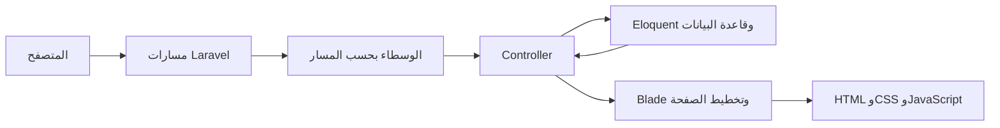
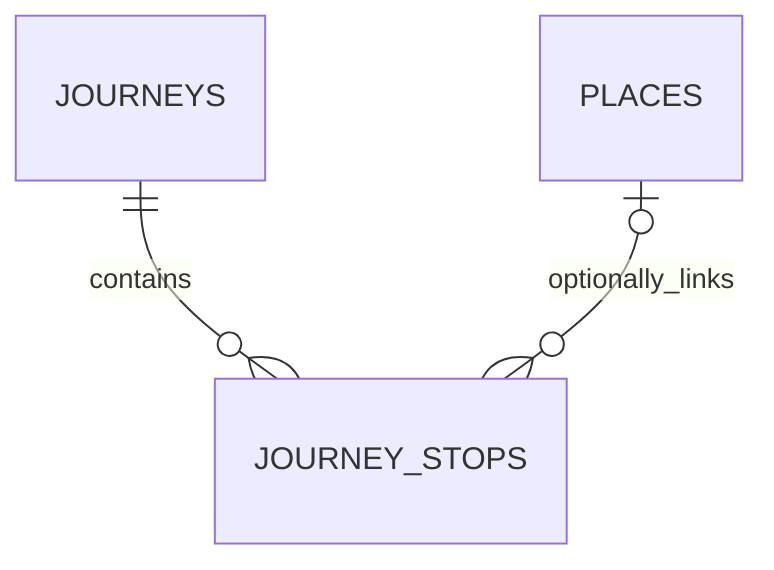

# دليل مشروع Meso Travels — ميسو ترافلز

تاريخ المراجعة: 27 سبتمبر 2026.

هذا المستند يصف ما ينفذه المشروع فعلياً: المميزات، تنظيم الملفات، البيانات، المسارات، إدارة المحتوى، نظام التصميم، والتشغيل. اسم العرض الحالي **Meso Travels**؛ بعض بيانات البذر القديمة تحتفظ باسم Iraq Revealed.

## 1. فكرة المشروع والمميزات

موقع لعرض رحلات ثقافية داخل العراق. يقرأ المحتوى من قاعدة البيانات ويعرضه باستخدام Laravel وBlade، مع لوحة لإدارة النصوص والرحلات والوجهات. الواجهة العامة بالعربية والإنجليزية، ولوحة إدارة واحدة لتحرير المحتوى العربي والإنجليزي معاً.

| الجزء | المميزات المتاحة |
| --- | --- |
| الرئيسية | صورة ومقدمة، تعريف بالمشروع، أول رحلة منشورة ومحطاتها، رحلات إضافية، الوجهات المنشورة، فئات التجارب، مبادئ العمل، وخاتمة للتواصل |
| تفاصيل الرحلة | العنوان والوصف والسعر والمدة، عدد المحطات، خط السير، الصور، قوائم المشمول وغير المشمول، ورحلات أخرى منشورة |
| تفاصيل الوجهة | الاسم والمقدمة والنص والصورة، ومحطات الرحلات المنشورة مع رابط تفاصيل الرحلة |
| اللغات | مسارات عربية وإنجليزية، اتجاه RTL، وتبديل اللغة مع البقاء على صفحة الرحلة أو الوجهة نفسها |
| إدارة المحتوى | إنشاء وتعديل وحذف الرحلات والوجهات والفئات ومبادئ العمل والمحطات؛ عرض وتعديل مفاتيح نصوص الموقع الموجودة |
| لوحة الملخص | أعداد سجلات المحتوى وروابط الإدارة وقوائم مختصرة للوجهات والرحلات |
| الحساب | التسجيل والدخول والخروج، استعادة كلمة المرور وتأكيدها، تعديل الاسم والبريد وكلمة المرور، وحذف الحساب بعد تأكيد كلمة المرور |
| الصور | رفع صورة للوجهة أو الرحلة أو المحطة أو سجل نصوص؛ عرض رسومات SVG التجريبية في التخزين العام |
| الهاتف والوصول | تصميم متجاوب، جداول قابلة للتمرير، روابط انتقال للمحتوى، تركيز مرئي، تسميات حقول ورسائل خطأ، وإغلاق قائمة الهاتف بمفتاح Escape |

### حدود النطاق الحالي

- لا توجد حجوزات أو مدفوعات أو تقويم مواعيد أو توافر مقاعد أو فواتير أو إدارة عملاء.
- الأسعار والمدد نصوص عرض ثنائية اللغة؛ لا توجد حسابات مالية أو عملات محسوبة أو تسعير حسب عدد الأشخاص.
- الاستفسار يفتح برنامج البريد لدى الزائر باستخدام `mailto:`. لا يوجد نموذج تواصل يرسل من الخادم أو يحفظ الرسائل.
- الوصول إلى الإدارة متاح للحسابات المسجلة عبر دخول موحد. التسجيل العام معطل افتراضياً؛ البيانات السياحية مشتركة وثنائية اللغة وليست موقعين مستقلين.
- توجد مسارات وقوالب للتحقق من البريد، لكن `User` لا يطبّق `MustVerifyEmail`، ولا تستخدم الإدارة وسيط `verified`. التحقق من البريد غير مفروض.
- المعرض يقرأ `gallery` من قاعدة البيانات ويضيف صور المحطات. لا توجد واجهة مستقلة لرفع صور المعرض أو ترتيبها.
- جميع الفئات ومبادئ العمل تظهر في الرئيسية؛ لا تملك حالة نشر. الفئات وصفية وليست تصنيفاً مرتبطاً بالرحلات أو الوجهات.
- نوع الرحلة «خاصة وموجهة» ولغاتها «الإنجليزية، العربية» نصوص ثابتة في قالب التفاصيل وليست حقول إدارة.
- لا توجد واجهة لإدارة المستخدمين أو تنظيف الصور القديمة أو استعادة السجلات المحذوفة.

## 2. التقنيات والهيكل العام

| التقنية | الاستخدام |
| --- | --- |
| PHP 8.2+ وLaravel 11 | المسارات والتحقق والجلسات والمصادقة والبيانات والتخزين |
| Blade ومكونات Laravel | الصفحات والتخطيطات والحقول المشتركة |
| Eloquent | نماذج المحتوى والعلاقات |
| Tailwind CSS 3 وVite 6 | بناء أصول واجهات الإدارة والحساب |
| Alpine.js | تفاعلات المكونات، ومنها نافذة تأكيد حذف الحساب |
| JavaScript مباشر | قائمة الموقع العام وحالة الرأس عند التمرير |
| PHPUnit | اختبارات الصفحات والربط والإدارة والحساب |

قاعدة البيانات تحددها البيئة. يمكن استخدام SQLite محلياً أو ضبط MySQL في XAMPP؛ لا يعني وجود SQLite أن المشروع مقيد به. الاختبارات تستخدم SQLite في الذاكرة.

```text
app/
├── Http/Controllers/
│   ├── HomeController.php
│   ├── JourneyController.php
│   ├── PlaceController.php
│   ├── ProfileController.php
│   ├── Admin/              # إدارة المحتوى والمحطات والملخص
│   ├── Auth/               # الحسابات وكلمات المرور والتحقق
│   └── Concerns/UploadsImages.php
├── Http/Middleware/SetAdminLocale.php
├── Http/Requests/          # تحقق الدخول وتعديل الحساب
├── Models/                 # نماذج البيانات
├── Support/helpers.php     # اللغة والروابط والصور والتواصل
├── Traits/HasLocalizedFields.php
└── View/Components/        # AppLayout وAdminLayout وGuestLayout
bootstrap/app.php          # تهيئة التطبيق ومسار الصحة
config/                    # قاعدة البيانات والبريد والتخزين والتواصل
database/
├── migrations/            # الجداول والعلاقات
├── factories/             # بيانات الاختبارات
└── seeders/               # المحتوى والحساب التجريبيان
public/
├── assets/                # الشعار وصورة النهر
├── css/                   # meso-travels / meso-admin / meso-account
├── js/meso-travels.js      # قائمة الواجهة العامة
├── build/                 # نواتج Vite
└── storage                # رابط إلى storage/app/public
resources/
├── views/                 # الواجهة العامة والإدارة والحساب
├── css/app.css            # مدخل Tailwind
└── js/app.js              # تهيئة Alpine
routes/web.php             # الموقع والإدارة
routes/auth.php            # المصادقة والحساب
storage/app/public/images/ # الصور المرفوعة والرسومات التجريبية
tests/                     # اختبارات الوظائف والوحدات
```

### مسار الطلب ومسؤوليات الملفات



لا تتطلب المسارات العامة الدخول. يقرأ `HomeController` النصوص والرحلات والوجهات المنشورة والفئات والمبادئ. تعرض متحكمات التفاصيل المحتوى المنشور فقط وتجهز بيانات النصوص واللغة البديلة.

تتحقق متحكمات `Admin` من المدخلات وتحفظ المحتوى والصور. يعيد `JourneyStopController::index` التوجيه إلى تحرير الرحلة لأن المحطات تدار ضمن رحلة محددة. يعالج `ProfileController` معلومات الحساب وحذفه، وتدير متحكمات `Auth` الدخول وكلمات المرور.

يعرض `AppLayout` الرأس والتذييل وعنوان الصفحة ووصفها ورابط اللغة البديلة. تستخدم لوحة الإدارة الموحدة `AdminLayout` مع حقول للغتين وترجمات متاحة في `lang/ar.json`، والمصادقة `GuestLayout`، والملف الشخصي `resources/views/components/account-layout.blade.php`.

## 3. قاعدة البيانات والعلاقات

تتضمن سجلات المحتوى معرفاً وتاريخي الإنشاء والتحديث. الحقول المنتهية بـ`_en` و`_ar` تخزن اللغتين في السجل نفسه.

| النموذج / الجدول | الحقول الرئيسية | الاستخدام |
| --- | --- | --- |
| `Page` / `pages` | `key` فريد، `title_en/ar`، `body_en/ar`، `image_path` | نصوص الأقسام وبيانات الصفحة |
| `Journey` / `journeys` | `slug` فريد، العنوان والمقدمة والوصف والسعر والمدة، `included` و`excluded`، الصورة، `gallery` بصيغة JSON، `order`، `is_published` | الرحلة وتفاصيلها |
| `JourneyStop` / `journey_stops` | `journey_id`، `place_id` اختياري، الترتيب والاسم والتسمية والوصف والصورة | محطة ضمن رحلة |
| `Place` / `places` | `slug` فريد، الاسم والمقدمة والنص والصورة، الترتيب والنشر | وجهة قابلة للربط بعدة محطات |
| `Category` / `categories` | `slug` فريد، العنوان والوصف، `roman_numeral`، `order` | فئات التجارب |
| `ApproachPoint` / `approach_points` | العنوان والوصف والترتيب | مبادئ العمل |
| `User` / `users` | الاسم والبريد الفريد وكلمة المرور المشفرة وتاريخ التحقق و`dashboard_locale` | الحسابات |



لكل محطة رحلة واحدة، ويمكن ربطها بوجهة واحدة أو تركها بلا وجهة. قد تتكرر الوجهة داخل رحلة أو تظهر في عدة رحلات. حذف الرحلة يحذف محطاتها عبر `cascadeOnDelete`. حذف الوجهة يحول `place_id` إلى `null` ويحافظ على نصوص المحطات. لا توجد علاقة بين الفئات والرحلات أو علاقة ملكية بين المستخدم والمحتوى. الحقل التاريخي `dashboard_locale` محفوظ دون استخدام لتحديد الوصول أو لغة اللوحة. كل حساب مسجل يستطيع إدارة المحتوى؛ لا يوجد نظام أدوار منفصل.

توجد أيضاً جداول Laravel للجلسات ورموز استعادة كلمة المرور والتخزين المؤقت والوظائف الخلفية. وجود جداول الوظائف لا يعني وجود نظام حجوزات أو رسائل مجدولة في التطبيق.

### الترتيب والنشر

- ترتب قوائم المحتوى الأساسية وفق `order` تصاعدياً. الخاصية `number` تعرض الترتيب بخانتين مثل `01`؛ لا يشترط تفرده ولا يعاد تسلسله تلقائياً عند الحذف.
- أول رحلة منشورة وفق الترتيب تظهر كرحلة أساسية، وتعرض بقية الرحلات المنشورة كرحلات إضافية.
- رابط رحلة أو وجهة غير منشورة يرجع `404`، حتى للمستخدم المسجل. لا يوجد مسار معاينة خاص للمسودات.
- تبقى محطة الرحلة المرتبطة بوجهة مخفية معروضة كنص، ويختفي رابط تلك الوجهة. تستبعد صفحة الوجهة محطات الرحلات غير المنشورة.

## 4. اللغات والروابط والصور

المسار بلا لاحقة إنجليزي، واللاحقة `/ar` عربية، وتقبل المسارات أيضاً `/en`. يعاد ضبط اللغة صراحة لكل طلب عام. لا يستبدل المتصفح نصوص الصفحة عند تغيير اللغة، ولا يعتمد اختيار اللغة على `localStorage`.

تستخدم `HasLocalizedFields` القيمة العربية عند اختيارها؛ إذا كانت `null` تستخدم الإنجليزية. تحول Laravel الحقول الفارغة في النماذج المعتادة إلى `null`. لا توجد ترجمة آلية. تحول `localizedParagraphs()` النص المقسم بأسطر فارغة إلى فقرات مع تهريب النص، ولذلك لا تنفذ وسوم HTML المدخلة من الإدارة.

| الدالة | الوظيفة |
| --- | --- |
| `site_locale()` | `ar` أو `en` |
| `other_site_locale()` | اللغة الأخرى |
| `site_home_url($anchor)` | الرئيسية باللغة الحالية مع مرساة اختيارية |
| `site_language_url()` | اللغة الأخرى مع الحفاظ على الرحلة أو الوجهة الحالية |
| `site_image_url($path, $fallback)` | رابط صورة موحد وبديل اختياري |
| `site_contact_url($subject)` | رابط بريد من الإعداد مع عنوان رسالة اختياري |

تقبل دالة الصور مسارات مثل `images/places/photo.jpg`، والمسارات المسبوقة بـ`storage/` أو `assets/`، وروابط HTTP/HTTPS الكاملة. لا تفحص وجود الملف أو وصول الخادم الخارجي.

### التخزين وحدود الرفع

| السجل | الحد البرمجي | المجلد داخل القرص العام |
| --- | --- | --- |
| الوجهة | 2048 KB، أي 2 MB | `images/places` |
| الرحلة | 3072 KB، أي 3 MB | `images/journeys` |
| المحطة | 3072 KB، أي 3 MB | `images/stops` |
| نص الموقع | 4096 KB، أي 4 MB | `images/pages` |

يستخدم الرفع حقل `image_path` والتحقق من كونه صورة. تؤثر أيضاً حدود PHP مثل `upload_max_filesize` و`post_max_size`. تخزن الملفات في `storage/app/public` ويعرضها الرابط `public/storage`. رسومات البذر الحالية SVG في `images/hero` و`images/places`.

يختار الخادم امتداد الصورة من نوعها، ويولد اسماً فريداً UUID لتجنب تصادم الأسماء. ملفات SVG التجريبية الموجودة تستمر بالعرض، بينما الرفع الجديد يقبل الصور النقطية فقط. عدم رفع بديل عند التعديل يبقي الصورة الحالية. رفع بديل لا يحذف الملف القديم تلقائياً. يبدأ معرض الرحلة بمصفوفة `gallery` إن وجدت؛ وإلا يستخدم صورة الرحلة، ثم يضيف صور المحطات غير المكررة. تعديل صورة الرحلة لا يستبدل عناصر المعرض القديمة تلقائياً.

## 5. خريطة محتوى الرئيسية

تعدل المفاتيح التالية من **Site copy**. أغلب النصوص المعروضة تستخدم `title_en/ar` حتى عندما ينتهي اسم المفتاح بكلمة `body`. الحقل الطويل المستخدم فعلياً هو `body` لسجل `intro_body`.

| المفتاح | الحقل المستخدم | موضع العرض |
| --- | --- | --- |
| `meta_title` | `title` | عنوان تبويب الرئيسية؛ التفاصيل تستخدم اسم السجل |
| `meta_description` | `title` | الوصف الافتراضي؛ التفاصيل قد تمرر وصفاً خاصاً |
| `hero_eyebrow` | `title` | السطر الصغير أعلى عنوان البداية |
| `hero_heading` | `title` و`image_path` | عنوان البداية وصورتها؛ صورة النهر بديل |
| `hero_sub` | `title` | فقرة البداية |
| `hero_cta` | `title` | رابط الانتقال لقسم الرحلات |
| `intro_eyebrow` | `title` | تسمية قسم التعريف |
| `intro_heading` | `title` | عنوان التعريف |
| `intro_body` | `body` | فقرات التعريف؛ عنوان السجل لا يظهر هنا |
| `journey_eyebrow` | `title` | تسمية الرحلة الأساسية |
| `places_eyebrow` | `title` | تسمية الوجهات |
| `places_heading` | `title` | عنوان الوجهات |
| `categories_eyebrow` | `title` | تسمية التجارب |
| `categories_heading` | `title` | عنوان التجارب |
| `approach_eyebrow` | `title` | تسمية نهج العمل |
| `approach_heading` | `title` | عنوان نهج العمل |
| `cta_eyebrow` | `title` | السطر الصغير في الخاتمة |
| `cta_heading` | `title` | عنوان الخاتمة |
| `cta_body` | `title` | فقرة الخاتمة |
| `cta_button` | `title` | العودة للرحلات عند غياب بريد التواصل |
| `footer_tagline` | `title` | العبارة التعريفية في التذييل |
| `footer_copyright` | `title` | حقوق النشر؛ السنة تضاف من القالب |

عنوان الرحلة الأساسية ومقدمتها ووصفها وسعرها ومحطاتها تأتي من `Journey` و`JourneyStop`، والوجهات من `Place`، والتجارب من `Category`، والمبادئ من `ApproachPoint`. تسميات التنقل والأزرار العامة وحالات الفراغ معرفة في القوالب.

الصورة الوحيدة المستخدمة من سجلات `Page` حالياً هي صورة `hero_heading`. رفع صورة إلى سجل آخر أو تعديل `body` خارج `intro_body` يحفظ البيانات لكنه لا يغير العرض الحالي. لا تسمح الإدارة بإنشاء مفاتيح أو حذفها؛ إضافة مفتاح وقسم جديدين تحتاج تعديل القالب وبياناته.

## 6. استخدام الإدارة

1. سجل الدخول عبر `/login` ثم افتح `/admin`. تعرض اللوحة حقول الإنجليزية والعربية معاً؛ زيارة الموقع العام لا تغير لغة واجهة الإدارة الإنجليزية.
2. من **Places** أضف الاسم والترتيب والمقدمة والنص باللغتين والصورة. فعّل **Published** لإتاحة الوجهة للزوار.
3. من **Journeys** أضف عنوان الرحلة ووصفها وسعرها ومدتها وصورتها. اكتب كل عنصر مشمول أو غير مشمول في سطر مستقل.
4. احفظ الرحلة وأضف محطاتها من تحرير الرحلة. لكل محطة اسم وترتيب وتسمية ووصف وصورة اختيارية وربط اختياري بوجهة.
5. استخدم **Categories** لفئات التجارب و**Approach points** لمبادئ العمل؛ الترتيب يحدد ظهورها.
6. عدل **Site copy** وفق جدول المفاتيح. صورة البداية تخص `hero_heading`.
7. راجع النتيجة باللغتين. روابط عرض التفاصيل متاحة للسجلات المنشورة.
8. من **Account** عدل الحساب أو كلمة المرور. حذف الحساب يتطلب كلمة المرور الحالية وينهي الجلسة.

### الروابط المختصرة Slugs

للرحلات والوجهات والفئات `slug` فريد. تركه فارغاً يولده من العنوان الإنجليزي أو اسم الوجهة. تطبّع القيمة قبل فحص التفرد؛ التعارض يعيد خطأ تحقق يمكن تصحيحه بالنموذج بدلاً من خطأ قاعدة بيانات.

تغيير `slug` يغير الرابط، ولا توجد تحويلات تلقائية من الروابط القديمة. روابط الموقع المولدة تتبع القيمة الجديدة. المحطات ونصوص الموقع تستخدم معرفات رقمية في مسارات الإدارة؛ يبقى `key` الخاص بنص الموقع ثابتاً.

## 7. المسارات

المصدر المعتمد `routes/web.php` و`routes/auth.php`. تقبل مسارات `GET` أيضاً `HEAD` وفق Laravel. يمكن استعراض المسارات الفعلية باستخدام `php artisan route:list --except-vendor`.

### الموقع العام

| الطريقة | المسار | الاسم / الوظيفة |
| --- | --- | --- |
| GET | `/` | `home`، الرئيسية الإنجليزية |
| GET | `/en` أو `/ar` | `home.locale` |
| GET | `/places/{place:slug}` | `places.show`، تفاصيل إنجليزية |
| GET | `/places/{place:slug}/{locale}` | `places.show.locale`؛ اللغة `en` أو `ar` |
| GET | `/journeys/{journey:slug}` | `journeys.show`، تفاصيل إنجليزية |
| GET | `/journeys/{journey:slug}/{locale}` | `journeys.show.locale`؛ اللغة `en` أو `ar` |
| GET | `/up` | فحص صحة Laravel من `bootstrap/app.php` |

مراسي الرئيسية `#journey` و`#places` و`#approach` و`#contact`، مع `#top` للعودة للأعلى و`#main` للانتقال للمحتوى. تعرض صفحة الخطأ `404` تنسيقاً متوافقاً مع الهوية؛ قوالب الأخطاء في `resources/views/errors`.

### الدخول والحساب

| الطريقة | المسار | الاسم | الوصول / الوظيفة |
| --- | --- | --- | --- |
| GET | `/register` | `register` | ضيف: التسجيل |
| POST | `/register` | بلا اسم مستقل | ضيف: إنشاء الحساب وبدء الجلسة |
| GET | `/login` | `login` | ضيف: الدخول |
| POST | `/login` | بلا اسم مستقل | ضيف: بدء الجلسة |
| GET | `/forgot-password` | `password.request` | ضيف: طلب الاستعادة |
| POST | `/forgot-password` | `password.email` | ضيف: إرسال رابط الاستعادة |
| GET | `/reset-password/{token}` | `password.reset` | ضيف: نموذج إعادة التعيين |
| POST | `/reset-password` | `password.store` | ضيف: حفظ كلمة المرور الجديدة |
| GET | `/verify-email` | `verification.notice` | مسجل: إشعار التحقق |
| GET | `/verify-email/{id}/{hash}` | `verification.verify` | مسجل، رابط موقّع، حد 6 طلبات بالدقيقة |
| POST | `/email/verification-notification` | `verification.send` | مسجل: إعادة الإرسال، حد 6 طلبات بالدقيقة |
| GET | `/confirm-password` | `password.confirm` | مسجل: نموذج التأكيد |
| POST | `/confirm-password` | بلا اسم مستقل | مسجل: التحقق من كلمة المرور |
| PUT | `/password` | `password.update` | مسجل: تغيير كلمة المرور |
| GET | `/profile` | `profile.edit` | مسجل: إعدادات الحساب |
| PATCH | `/profile` | `profile.update` | مسجل: تحديث الاسم والبريد |
| DELETE | `/profile` | `profile.destroy` | مسجل: الحذف بعد تأكيد كلمة المرور |
| POST | `/logout` | `logout` | مسجل: إنهاء الجلسة |
| GET | `/dashboard` | `dashboard` | يحول إلى لوحة الإدارة الموحدة `/admin` |

وجود مسارات التحقق لا يفرض التحقق من البريد على الدخول أو الإدارة. تستخدم النماذج CSRF وحقول `_method` لعمليات مثل `PATCH` و`DELETE`.

### الإدارة

مسارات `/admin` محمية بالمصادقة وتستخدم `SetAdminLocale` لضبط واجهة الإدارة بالإنجليزية مع حقول المحتوى باللغتين. اسم `GET /admin` هو `admin.dashboard`، وبادئة أسماء الموارد هي `admin.`. تعيد روابط اللوحات القديمة `/admin/en` و`/admin/ar` التوجيه إلى المسارات الموحدة. الموارد التالية تستخدم نمط العمليات نفسه:

| المورد | معامل السجل | المتحكم | أساس اسم المسار |
| --- | --- | --- | --- |
| `places` | `{place}`، slug | `Admin\PlaceController` | `admin.places` |
| `journeys` | `{journey}`، slug | `Admin\JourneyController` | `admin.journeys` |
| `categories` | `{category}`، slug | `Admin\CategoryController` | `admin.categories` |
| `approach-points` | `{approach_point}`، معرف رقمي | `Admin\ApproachPointController` | `admin.approach-points` |

| الطريقة | نمط المسار لكل مورد | لاحقة الاسم | العملية |
| --- | --- | --- | --- |
| GET | `/admin/{resource}` | `.index` | القائمة |
| GET | `/admin/{resource}/create` | `.create` | نموذج الإضافة |
| POST | `/admin/{resource}` | `.store` | الحفظ |
| GET | `/admin/{resource}/{record}/edit` | `.edit` | نموذج التعديل |
| PUT أو PATCH | `/admin/{resource}/{record}` | `.update` | حفظ التعديل |
| DELETE | `/admin/{resource}/{record}` | `.destroy` | الحذف |

لا يوجد مسار `show` إداري لهذه الموارد. `{record}` هو معامل السجل المحدد في الجدول السابق.

| الطريقة | مسار المحطات | الاسم |
| --- | --- | --- |
| GET | `/admin/journeys/{journey}/stops` | `admin.journeys.stops.index`؛ يحول إلى تحرير الرحلة |
| GET | `/admin/journeys/{journey}/stops/create` | `admin.journeys.stops.create` |
| POST | `/admin/journeys/{journey}/stops` | `admin.journeys.stops.store` |
| GET | `/admin/journeys/{journey}/stops/{stop}/edit` | `admin.journeys.stops.edit` |
| PUT أو PATCH | `/admin/journeys/{journey}/stops/{stop}` | `admin.journeys.stops.update` |
| DELETE | `/admin/journeys/{journey}/stops/{stop}` | `admin.journeys.stops.destroy` |

تستخدم `{journey}` الرابط المختصر و`{stop}` المعرف الرقمي. طلب محطة عبر رحلة أخرى يرجع `404` ولا يعدلها أو يحذفها.

| الطريقة | مسار نصوص الموقع | الاسم |
| --- | --- | --- |
| GET | `/admin/pages` | `admin.pages.index` |
| GET | `/admin/pages/{page}/edit` | `admin.pages.edit` |
| PUT أو PATCH | `/admin/pages/{page}` | `admin.pages.update` |

`{page}` معرف رقمي؛ لا توجد عمليات إنشاء أو حذف أو عرض مستقل لنصوص الموقع.

## 8. نظام التصميم المشترك

الألوان الأساسية في `public/css/meso-travels.css`. تستخدمها ملفات الإدارة والحساب عبر متغيرات CSS.

| المتغير | القيمة | الاستخدام |
| --- | --- | --- |
| `--ink` | `#081a24` | النصوص والخلفيات الداكنة |
| `--ink-soft` | `#183342` | النصوص الثانوية |
| `--lapis` | `#063e61` | الأزرق الرئيسي |
| `--lapis-deep` | `#061b2a` | الرأس والأقسام الداكنة |
| `--river` | `#2a7188` | الروابط والعناصر المساندة |
| `--sand` | `#e8d1a4` | التفاصيل والخلفيات الرملية |
| `--sun` | `#efb657` | الذهبي والأزرار البارزة |
| `--paper` | `#f4efe5` | خلفية الصفحات |
| `--paper-bright` | `#fbf8f1` | البطاقات والنماذج |
| `--white` | `#fffdf8` | النصوص الفاتحة |
| `--line` | `rgba(8, 26, 36, 0.18)` | الحدود والفواصل |

الإنجليزية تستخدم **Newsreader** للعناوين و**DM Sans** للنصوص. العربية تستخدم **Noto Naskh Arabic** للعناوين و**Noto Kufi Arabic** للنصوص. تحمل الخطوط من Google Fonts مع عائلات بديلة محلية عند تعذر التحميل.

| الملف | المسؤولية |
| --- | --- |
| `public/css/meso-travels.css` | الهوية والرئيسية والتفاصيل والرأس والتذييل وRTL |
| `public/css/meso-admin.css` | الإدارة والتنقل والجداول والنماذج والرسائل |
| `public/css/meso-account.css` | الدخول والتسجيل وكلمات المرور والملف الشخصي |
| `resources/css/app.css` | مدخل Tailwind والأساسيات المبنية |
| `public/js/meso-travels.js` | قائمة الموقع العام والتركيز وحالة الرأس |
| `resources/js/app.js` | تهيئة Alpine للمكونات |

الموقع العام يحمل CSS وJavaScript العامين مباشرة من `public`، بينما تحمل الإدارة والحساب أيضاً نواتج Vite. بعد تعديل مصادر البناء أو أصناف Tailwind بالقوالب، أعد `npm run build`. تعديل ملفات `public/css` و`public/js` لا يحتاج Vite لكنه قد يحتاج تحديث ذاكرة المتصفح.

## 9. التشغيل المحلي وXAMPP

يلزم PHP 8.2+ وComposer وNode.js/npm متوافقان مع Vite 6 وإضافات PHP المطلوبة في Composer. يلزم `pdo_sqlite` لـSQLite والاختبارات، أو امتداد MySQL عند اختياره. استخدم PHP متوافقاً في سطر الأوامر وApache.

### تثبيت جديد

1. ثبت الاعتماديات:

   ```bash
   composer install
   npm ci
   npm run build
   ```

2. انسخ `.env.example` إلى `.env` **فقط إن لم يكن ملف البيئة موجوداً**، واضبط `APP_URL` وقاعدة البيانات. لا تستبدل ملف بيئة قائم.
3. لـSQLite أنشئ `database/database.sqlite` واضبط `DB_CONNECTION=sqlite` و`DB_DATABASE` إلى مساره. أو اضبط اتصال MySQL بقاعدة XAMPP المناسبة.
4. في التثبيت الأول أنشئ مفتاح التطبيق، ثم الجداول ورابط التخزين:

   ```bash
   php artisan key:generate
   php artisan migrate
   php artisan storage:link
   ```

5. أضف المحتوى والحساب **التجريبيين** عند الحاجة في تثبيت جديد:

   ```bash
   php artisan db:seed
   ```

6. شغل الموقع:

   ```bash
   php artisan serve
   ```

يمكن استخدام `npm run dev` أثناء تطوير الواجهة. يحتاج تحميل أصول التطوير إلى خادم Vite العامل، بينما تستخدم ملفات `public/build` للنشر.

### Apache في XAMPP

اجعل `DocumentRoot` يشير إلى `public`، مثل `/Applications/XAMPP/xamppfiles/htdocs/hasan/public` في النسخة المحلية على macOS. لا تجعل مجلد المشروع الذي يحتوي `.env` و`vendor` جذر الويب.

فعّل إعادة كتابة الروابط واسمح بقواعد `public/.htaccess` عبر `AllowOverride All`. اضبط `APP_URL` على العنوان الفعلي بما فيه المسار الفرعي إن استخدم. يحتاج مستخدم PHP إلى الكتابة في `storage` و`bootstrap/cache`، وملف SQLite ومجلده عند اختياره. يجب أن يشير `public/storage` إلى `storage/app/public` في الجهاز الحالي؛ قد يحتاج إعادة إنشاء عند نقل المشروع.

### بيانات التجربة

في local/testing فقط، ينشئ `AdminUserSeeder` المستخدم `admin@iraqrevealed.test` بكلمة المرور `password`. هذه بيانات تجريبية معلنة وليست بيانات البيئة الفعلية. غيّرها قبل استخدام بيانات حقيقية.

تستخدم أدوات بذر المحتوى `updateOrCreate`؛ إعادة تشغيلها قد تستبدل النصوص والرحلات التجريبية المعدلة. بذر الحساب التجريبي محصور في local/testing ولا يعيد تعيين كلمة مرور حساب موجود؛ يمنحه وصولاً إنجليزياً. البذر خطوة إعداد أولي أو عرض تجريبي، وليس خطوة نشر دورية أو شرطاً لتطبيق تغيير التصميم.

## 10. إعداد البيئة والتواصل والبريد

| المتغيرات | الغرض |
| --- | --- |
| `APP_NAME` | اسم Laravel في المواضع التي تستخدمه؛ هوية القوالب Meso Travels |
| `APP_URL` | أصل روابط التطبيق، خصوصاً المولدة خارج طلب المتصفح |
| `APP_ENV` و`APP_DEBUG` | بيئة التشغيل وتفاصيل الأخطاء |
| `APP_KEY` | مفتاح التشفير؛ ينشأ أول مرة ويحافظ عليه لاحقاً |
| `DB_CONNECTION` و`DB_DATABASE` وبقية `DB_*` | قاعدة البيانات والاتصال |
| `CONTACT_EMAIL_EN` و`CONTACT_EMAIL_AR` | بريد استفسار مستقل لكل لغة |
| `CONTACT_EMAIL` | بديل مشترك عند غياب بريد اللغة |
| `REGISTRATION_ENABLED` | فتح التسجيل العام اختيارياً؛ الافتراضي false ولا يمنح التسجيل صلاحية إدارة |
| `MAIL_MAILER` وبقية `MAIL_*` | إرسال رسائل الحساب من الخادم |
| `SESSION_DRIVER` و`CACHE_STORE` | تخزين الجلسات والذاكرة المؤقتة |
| `QUEUE_CONNECTION` | مشغل وظائف Laravel الخلفية عند استخدامها |

يقرأ `config/site.php` قيم `CONTACT_EMAIL_EN` و`CONTACT_EMAIL_AR`، مع `CONTACT_EMAIL` كبديل مشترك. تتقدم قيمة محفوظة من صفحة إعدادات التواصل في اللوحة الموحدة على قيمة البيئة. لا تفعّل عناوين `.test` روابط البريد العامة، لأنها أمثلة محلية وليست صناديق بريد حقيقية. عند غياب بريد صالح تعرض تفاصيل الرحلة رسالة توفر معلومات التواصل والحجز لاحقاً، وتعيد خاتمة الرئيسية الزائر إلى الرحلات. عند ضبطه يظهر رابط بريد مع عنوان رسالة خاص بالرحلة عند الحاجة.

ضبط بريد الاستفسار لا يشغل البريد الصادر من الخادم. لاستعادة كلمة المرور فعلياً اضبط ناقل بريد صالح في `config/mail.php` بمتغيرات مثل `MAIL_MAILER` و`MAIL_HOST` و`MAIL_PORT` و`MAIL_USERNAME` و`MAIL_PASSWORD` و`MAIL_FROM_ADDRESS` و`MAIL_FROM_NAME` وما يحتاجه المزود. الإعداد الافتراضي `log` يسجل الرسالة ولا يرسلها إلى صندوق خارجي.

يتضمن `.env.example` اسم Meso Travels وحقول بريد التواصل الثلاثة فارغة و`REGISTRATION_ENABLED=false`. لم يتطلب هذا التحديث تعديل `.env` الفعلي. لا تضع أسرار البيئة في المستند أو مستودع الشيفرة. بعد تغيير إعدادات مخزنة مؤقتاً استخدم:

```bash
php artisan config:clear
```

## 11. الاختبارات والتحقق

```bash
php artisan test
php artisan test --filter=LinkIntegrityTest
npm run build
php artisan route:list --except-vendor
```

يضبط `phpunit.xml` اتصال الاختبار إلى `sqlite` و`:memory:`، والبريد والجلسات والذاكرة المؤقتة إلى بدائل اختبارية. تستخدم اختبارات البيانات `RefreshDatabase`. لا تشغّل اختبارات تحديث البيانات على قاعدة فعلية؛ إذا كانت إعدادات Laravel مخزنة مؤقتاً من بيئة أخرى فامسح ذاكرة الإعداد وتحقق من اتصال الاختبار.

| الاختبارات | التغطية |
| --- | --- |
| `HomepageTest` | الرئيسية والعربية وتفاصيل الوجهات وحالة النشر |
| `JourneyFeatureTest` | الرحلات والأسعار والصور والنصوص والعربية والإنشاء الإداري |
| `AdminAccessTest` | دخول الإدارة وحفظ محتوى جديد |
| `LinkIntegrityTest` | إجراءات المسارات وتقييد المحطات والعلاقات المنشورة واللغة وتصادم slugs والصور والتواصل |
| `PublicContentTest` | ظهور تعديلات المحتوى والسجلات المنشورة باللغتين، صلاحية الروابط والمراسي العامة، وإظهار التواصل عند ضبط البريد |
| `DashboardLanguagesTest` | الدخول الموحد للحسابات الحالية، تحويل الروابط القديمة، تحرير اللغتين، وبريدا التواصل معاً |
| `DashboardUploadTest` | أسماء صور فريدة وامتدادات يحددها الخادم والحفاظ على الصورة عند تعديل النص |
| `Auth/*` و`ProfileTest` | التسجيل والدخول وكلمات المرور والتحقق وتحديث الحساب |

تراجع الواجهة أيضاً بعروض ضيقة، مع تجربة القائمة بعد التمرير واللغة البديلة والنماذج والروابط. نجاح طلب HTTP وحده لا يثبت شكل الواجهة أو وصول خدمة بريد خارجية.

### نتائج التحقق على هذه النسخة

- نجحت مجموعة الاختبارات: **54 اختباراً، 600 تحقق**، وخروج بالأكواد الناجحة. ظهرت إشعارات تقادم تخص `PDO::MYSQL_ATTR_SSL_CA` مع PHP 8.5 من اعتماديات Laravel.
- نجح `npm run build` وتجميع قوالب Blade عبر `php artisan view:cache`.
- شمل فحص Chrome عروض **1440 و390 و320 بكسل**، مع **30 فحص صفحة/عرض** للرئيسية والوجهات والرحلات بالعربية والإنجليزية وصفحات الدخول والتسجيل ونسيان كلمة المرور وإعادة تعيينها.
- شملت مراجعة HTML المعزول للإدارة والحساب والتأكيد والتحقق **24 فحص صفحة/عرض**، بما فيها القوائم والإضافة والتعديل ونصوص الموقع. تأكد فتح نافذة حذف الحساب.
- لم تظهر أخطاء JavaScript أو صور مفقودة أو تجاوزات أفقية للصفحة في الصفحات والأحجام المفحوصة. اختبرت كذلك صفحة `404` ذات الهوية المشتركة.
- قبل إعادة توحيد اللوحة، فُحصت إضافات المظهر في Chrome بـ65 تحققاً: دخول الحسابين، الشاشات 1440 و390 و320 بكسل، الوضعان الفاتح والداكن، حفظ الاختيار، تفضيل النظام، والعمل عند حظر localStorage. لم تظهر أخطاء JavaScript أو صور مفقودة أو تمرير أفقي زائد.
- هذه النتائج لا تتضمن إثبات إرسال SMTP إلى بريد خارجي أو تنفيذ حجز أو دفع؛ الحجز والدفع غير منفذين في المشروع.

## 12. النشر والصيانة

اضبط جذر الويب إلى `public` وإعدادات البيانات والتخزين والبريد والعنوان العام، واستخدم `APP_DEBUG=false` للإنتاج. افصل تحديث التطبيق عن توليد البيانات التجريبية، واحفظ نسخة من قاعدة البيانات و`storage/app/public` قبل تغييرات البيانات.

خطوات تحديث اعتيادية بعد تجهيز البيئة ومراجعة التغييرات:

```bash
composer install --no-dev --optimize-autoloader
npm ci
npm run build
php artisan migrate --force
php artisan config:cache
php artisan route:cache
php artisan view:cache
```

تشغّل الاختبارات في بيئة تطوير أو CI قبل تثبيت اعتماديات الإنتاج بـ`--no-dev`. تنفذ الهجرات وفق خطة النشر والنسخ الاحتياطي. لا تعِد `key:generate` على تطبيق قائم ولا `db:seed` على محتوى محرر ضمن نشر الملفات.

عند النقل، انقل الصور وأعد ضبط رابط التخزين. عند تعديل CSS المباشر تحقق من ذاكرة المتصفح. عند تغيير slug منشور حدّث الروابط الخارجية المعروفة لعدم وجود تحويل تلقائي.

الإدارة مشتركة لجميع الحسابات المسجلة. التسجيل العام مغلق افتراضياً؛ تفعيله يمنح الحسابات الجديدة إمكانية إدارة المحتوى. لا يوجد تقسيم لملكية الرحلات بين الحسابات، والتحقق من البريد غير مفروض.

## 13. الإصلاحات والتنظيم المنفذان

- توحيد الهوية والألوان والخطوط والشعار في الإدارة والمصادقة والحساب والتفاصيل والأخطاء، مع ملفات CSS تستفيد من المتغيرات المشتركة.
- ربط الرئيسية بمحتوى قاعدة البيانات وإزالة روابط الوجهات الثابتة من خط السير.
- جعل اللغة روابط حقيقية تحافظ على الصفحة؛ لم يعد JavaScript يستبدل النصوص بما يمحو الروابط أو يتجاوز المحتوى المحفوظ.
- تمرير بيانات العنوان والوصف والنصوص ورابط اللغة البديلة إلى `AppLayout`، وتصحيح مراسي العودة.
- تحسين RTL والتجاوب والنماذج والقائمة؛ معالجة تأثير مرشح الرأس على قائمة الهاتف بعد التمرير.
- إخفاء الروابط العامة للمحتوى غير المنشور مع الحفاظ على نص المحطات، وعدم عرض معاينة عامة مضمونة الفشل للمسودات.
- تقييد المحطات برحلاتها الصحيحة في مسارات التحرير والحذف.
- إزالة مسار عرض نصوص الموقع الإداري الذي لم يكن له إجراء منفذ.
- فحص تفرد slug بعد التطبيع ومعالجة التصادم كخطأ تحقق.
- توحيد روابط الصور وعرض الصورة الحالية في تحرير الوجهة، واستكمال الحقول العربية في نموذجها.
- استبدال بريد الاستفسار الوهمي بإعداد `CONTACT_EMAIL` وحالة واضحة عند غيابه.
- إضافة اختبارات لمشكلات الربط، وتوثيق المميزات والحدود الفعلية.

أعيدت الإدارة إلى لوحة واحدة دون قيود لغة على الحسابات، مع إبقاء التسجيل العام مغلقاً افتراضياً. لا يوجد نظام حجز أو دفع، ولا يحتاج التحديث إعادة بذر المحتوى.


## 14. لوحة موحدة والوضع الداكن — تحديث 27 سبتمبر

الدخول عبر `/login` والإدارة عبر `/admin`. تعرض النماذج حقول الإنجليزية والعربية معاً كما كانت سابقاً. أزيل الفصل بحسب لغة الحساب وزر الانتقال إلى دخول لغة أخرى. تحول روابط اللوحات القديمة إلى المسارات المشتركة.

لم تُحذف حسابات أو بيانات ولم تتغير كلمات المرور. يعمل الحساب الأصلي والحسابان المحليان السابقان من شاشة الدخول نفسها. تبقى كلمات المرور المحلية المولدة في `storage/app/private/dashboard-accounts.txt` خارج مجلد الويب. أبقي حقل `dashboard_locale` التاريخي في قاعدة البيانات دون الاعتماد عليه؛ لا تحتاج العودة إلى اللوحة الموحدة إلى ترحيل أو إعادة بذر.

لإنشاء حساب أو تحديث كلمة مروره محلياً:

```bash
php artisan dashboard:account admin@your-domain.com
```

يسأل الأمر عن كلمة مرور مخفية وتأكيدها، ويتطلب تأكيداً قبل تحديث حساب موجود. لا يحتاج معامل لغة. أزيل أمر إنشاء اللوحتين المنفصلتين.

تعرض **Contact settings** بريد الصفحة الإنجليزية وبريد الصفحة العربية في نموذج واحد. بقيت العناوين المحفوظة دون تغيير. عناوين `.test` أمثلة محلية ولا تنشئ صناديق بريد ولا تفعّل روابط بريد عامة؛ استبدلها بعناوين فعلية تملكها.

بقيت الإرشادات القصيرة وزر الوضع الفاتح/الداكن. يتبع المظهر تفضيل النظام أولاً ثم يحفظ الاختيار في `localStorage` بمفتاح `meso-theme`. الملفات المشتركة: `public/js/meso-theme.js` و`public/css/meso-theme.css` والمكون `theme-toggle` والجزء `partials/theme-head`.
